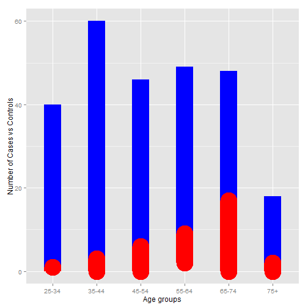

DataProductsSlide
========================================================
author: Karin
date: 24 October 2015

Introduction
========================================================

For this project I selected to use the Esoph package from the R Datasets Package.

Authors:
Thomas Lumley
Source

Breslow, N. E. and Day, N. E. (1980) Statistical Methods in Cancer Research. Volume 1: The Analysis of Case-Control Studies. IARC Lyon / Oxford University Press. 


Description
========================================================


Data from a case-control study of (o)esophageal cancer in Ille-et-Vilaine, France. 


Variable descriptions
========================================================

A data frame with records for 88 age/alcohol/tobacco combinations.

[,1] 	"agegp" - Age group 

            1 25--34 years
			2 35--44
			3 45--54
			4 55--64
			5 65--74
			6 75+
			
[,2] 	"alcgp" - Alcohol consumption 	

            1 0--39 gm/day
			2 40--79
			3 80--119
			4 120+
			
[,3] 	"tobgp" - Tobacco consumption 	

            1 0-- 9 gm/day
			2 10--19
			3 20--29
			4 30+
			
[,4] 	"ncases" 	Number of cases 	

[,5] 	"ncontrols" 	Number of controls 	

Using the application
========================================================
Select any available variable for the X axis. These are the descriptive variables in the data-set.

X-Axis:

agegp - Age group 

alcgp - Alcohol consumption 

tobgp - Tobacco consumption 

The quantitative variables will be available for the y axis.

Y-Axis:

ncases = No of cases

ncontrols = No of Controls

The data can be explored in the graph by choosing different variables to display in the graph. It is interactive to allow the user to explore and analyse the data as per individual requirements.

The same variables can also be used to display the data in colour category and/or factors per row and columns.

Explore Data
========================================================


```r
library(MASS)
y <- as.data.frame(esoph)
```

Plot
========================================================
No of cases comparing number of controls per age group

 

